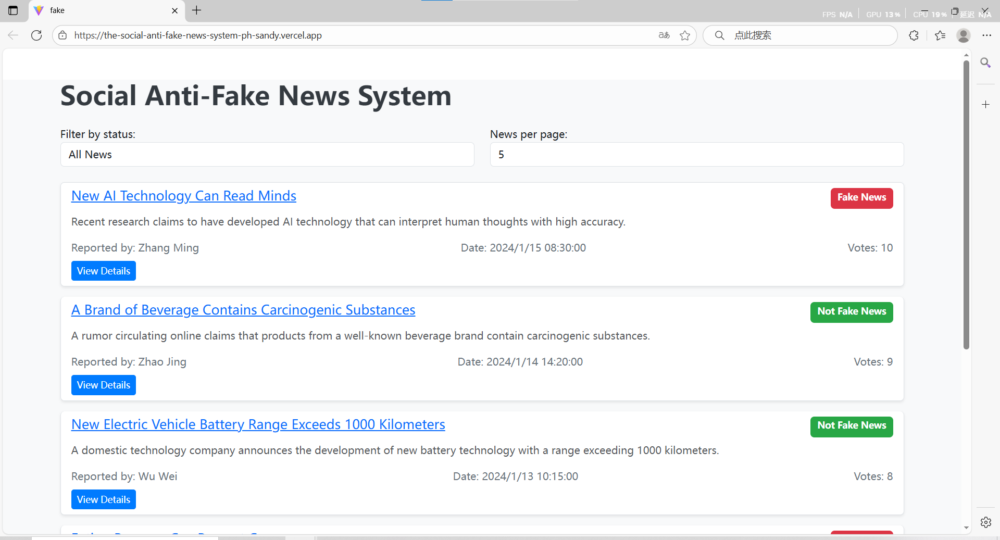
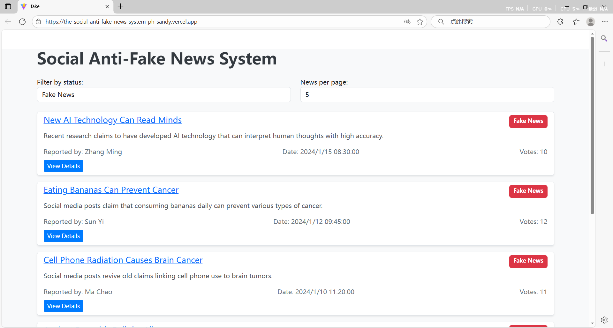
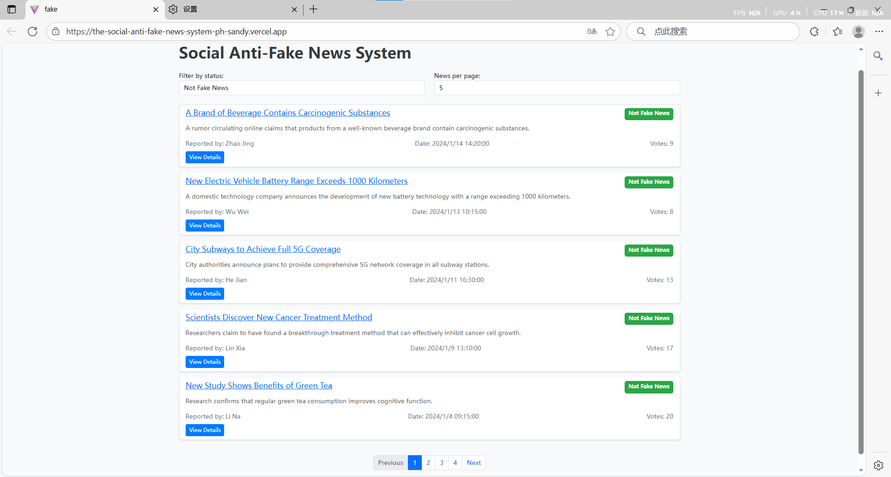
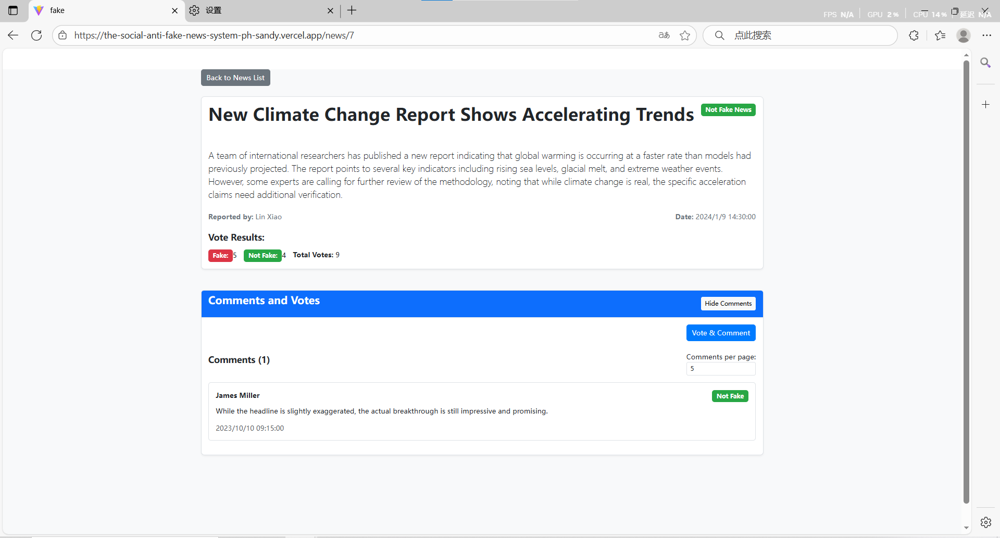
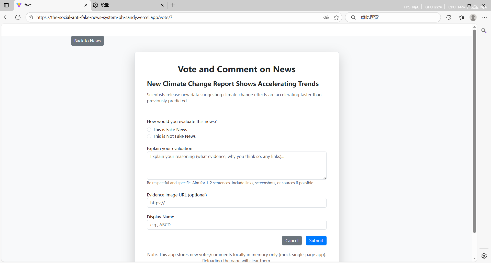
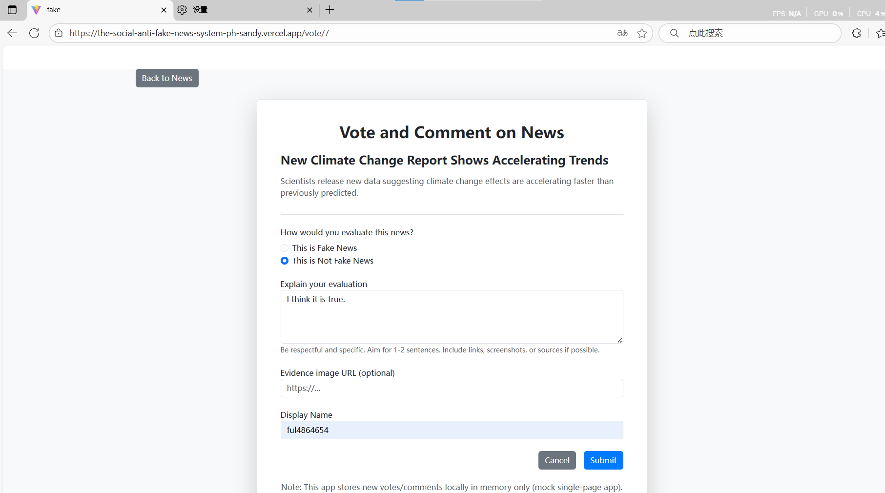
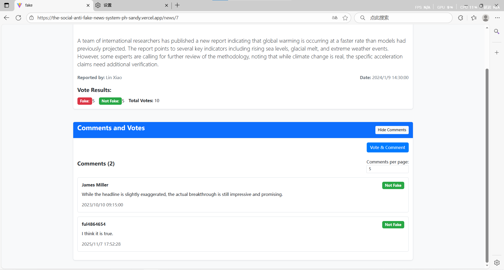

# Social Anti-Fake News System

## 1. Member

| Name       | ID         | Sec  | 
|------------|------------|------|
| fuyilin    | 20232050   |  2   | 
| wangyuhan  | 20232094   |  2   | 
| yuantaixian| 20232076   |  2   | 

## 2. Project name/Project Goal
Project name: Social Anti-Fake News System

Project goal: To create a platform that helps users identify and combat fake news through collective wisdom, allowing users to view news stories, vote on their authenticity, and provide comments with supporting evidence.

## 3. Features
F1: News List View - Browse all news with filtering options (All News, Fake News, Not Fake News)
F2: Pagination - Control the number of news items displayed per page
F3: News Details - View complete information about each news story
F4: Voting System - Vote whether news is fake or authentic

## 4. Tech Stack
- Frontend: React.js with Vite
- Routing: React Router
- Styling: CSS
- Mock Data: Local JavaScript data

## 5. Home Page






## 6. News Details Page




## 7. Vote & Comment Feature

### Vote & Comment Feature Design Displays






## 8. Deployment with Vercel
The application is deployed on Vercel. You can access it at: [https://the-social-anti-fake-news-system-ph-sandy.vercel.app/](https://the-social-anti-fake-news-system-ph-sandy.vercel.app/)

## 9. Submission
The Video is here. You can access it at: [https://the-social-anti-fake-news-system-ph-sandy.vercel.app/](https://the-social-anti-fake-news-system-ph-sandy.vercel.app/)


### Prerequisites
- Node.js (v14 or higher)
- npm or yarn

### Installation
1. Clone the repository
   ```bash
   git clone https://github.com/fu202322050/social-anti-fake-news.git
   cd social-anti-fake-news
   ```

2. Install dependencies
   ```bash
   npm install
   ```

3. Start the development server
   ```bash
   npm run dev
   ```

4. Open your browser and navigate to `http://localhost:5173`